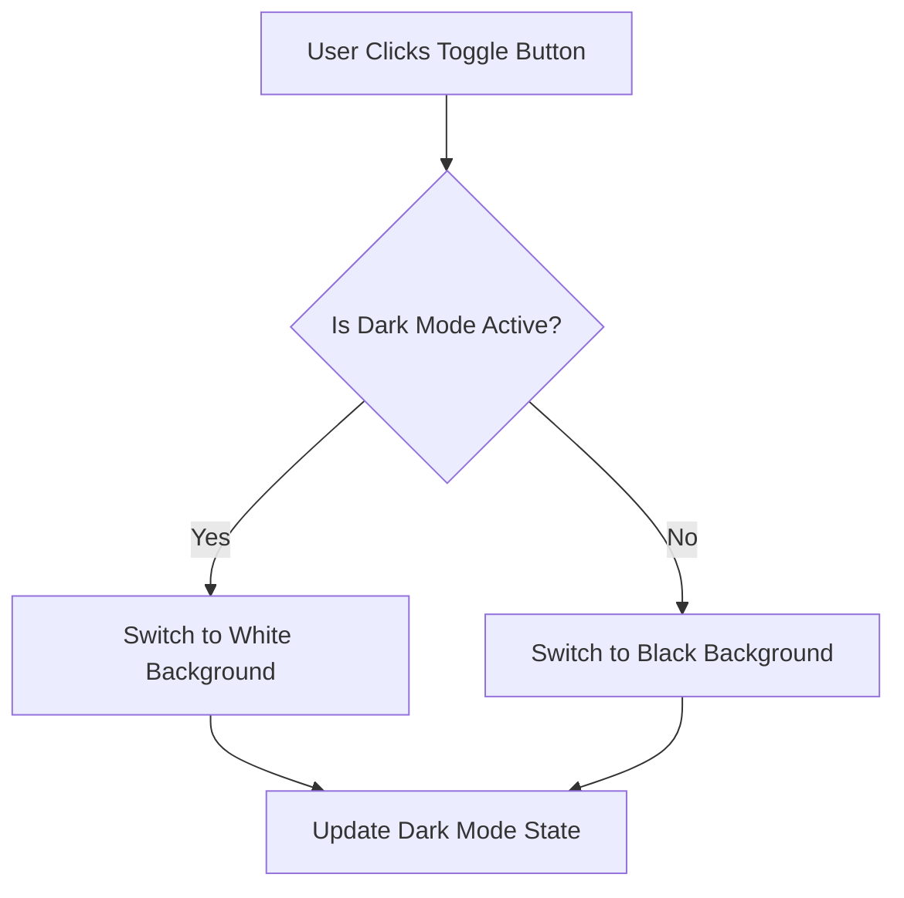

# Toggle Background Color

A simple project that allows you to toggle the background color of a webpage between black and white by clicking a button. The project is built using HTML, CSS, and JavaScript.

---

## 🖼️ Preview


---

## 📋 Features
- **Interactive Toggle**: A button to change the background color dynamically.
- **Smooth Transitions**: Visual transitions for a better user experience.
- **Customizable**: Easily adapt the styles and functionality for different themes.

---

## 📂 Project Structure
```plaintext
.
├── index.html     # Main HTML file
├── styles.css     # Styling for the webpage
└── script.js      # JavaScript functionality
```

---

## 🚀 How to Use

### Step 1: Clone the Repository
```bash
git clone https://github.com/your-username/toggle-bg-color.git
cd toggle-bg-color
```

### Step 2: Open the Project
- Open `index.html` in your browser.

### Step 3: Interact
- Click the "Toggle Background" button to switch between black and white backgrounds.

---

## 📊 Flowchart


---

## 🎨 Color Scheme
| Element             | Color               |
|---------------------|---------------------|
| Background (Light)  | White (#FFFFFF)    |
| Background (Dark)   | Black (#000000)    |
| Button (Default)    | Blue (#007BFF)     |
| Button (Hover)      | Dark Blue (#0056B3) |
| Text (Light Mode)   | Black (#000000)    |
| Text (Dark Mode)    | White (#FFFFFF)    |

---

## 🛠️ Technologies Used
- **HTML**: Structure of the webpage.
- **CSS**: Styling and transitions.
- **JavaScript**: Interactivity and toggle logic.

---

## 📈 Future Improvements
- Add more color themes for toggling.
- Save the background state using localStorage.
- Create a responsive design.

---

## 🤝 Contribution
Contributions are welcome! Feel free to open issues or submit pull requests.

1. Fork the repository.
2. Create a new branch for your feature/bug fix.
3. Commit your changes.
4. Push to your branch.
5. Open a pull request.

---

## 📄 License
This project is licensed under the [MIT License](LICENSE).

---

## 💡 Acknowledgments
Special thanks to the open-source community for inspiring this project.

---

### 📬 Contact
For any inquiries or suggestions, reach out to us:
- **Email**: your.email@example.com
- **GitHub**: [YourUsername](https://github.com/your-username)

